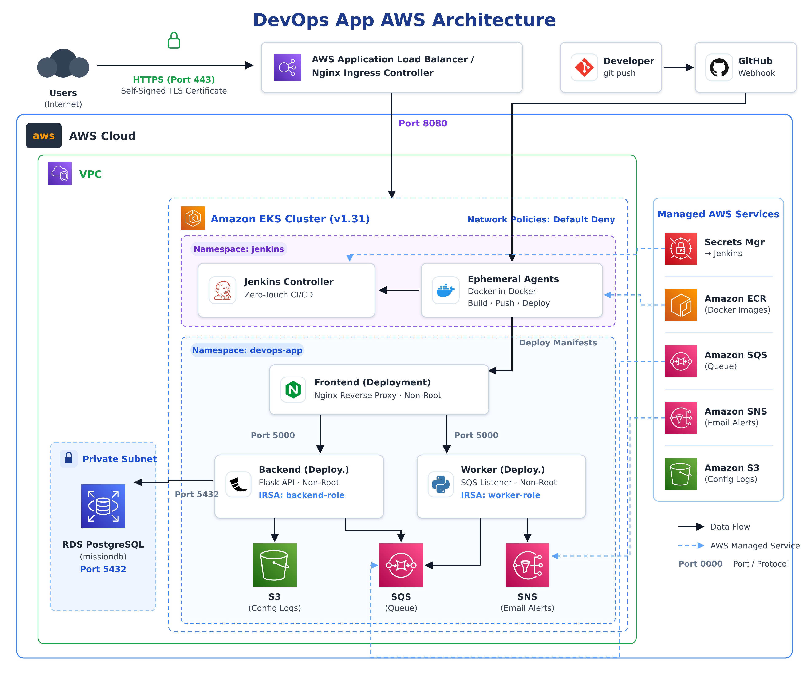

# Final Project: Automated and Distributed 3-Tier Cloud Infrastructure with Jenkins CI/CD

**Submitted by:** Aviv Moshe Negbi
**Course / Lecturer:** DevOps / Aviad (John Bryce)
**Date Updated:** August 2026

---

## 📋 Project Overview
This project presents an advanced, secure, and distributed cloud architecture using a **3-Tier Architecture** model on **AWS**. The entire system is provisioned and managed utilizing **Infrastructure as Code (IaC)**, **Configuration as Code (CaC)**, and a fully automated **CI/CD pipeline** orchestrated by Jenkins running inside Kubernetes.

### Architecture Boundaries
* **CI/CD Cluster (Jenkins):** Jenkins controller runs in a dedicated `jenkins` namespace. It dynamically provisions ephemeral Agent Pods to execute workloads and terminates them upon completion.
* **Application Cluster:** The 3-tier application runs in the `devops-app` namespace.
* **AWS Managed Services:** The underlying EKS infrastructure, RDS PostgreSQL, S3, SQS, SNS, ECR, and AWS Secrets Manager.

---

## 🛠️ Tech Stack & Prerequisites
* **Cloud & IaC:** AWS, Terraform 1.14.9, Helm
* **CI/CD:** Jenkins, Jenkins Configuration as Code (JCasC), Job DSL
* **Containers & Orchestration:** Docker, Kubernetes (Amazon EKS 1.31)
* **Agent Build Tools:** Docker-in-Docker (DinD) / Kaniko (Rootless building)
* **Prerequisites to run:** `aws-cli`, `kubectl`, `terraform`, `helm`, and valid AWS credentials.

---

## 🚀 The CI/CD Pipeline (Separation of Concerns)
Following best practices, the pipeline is strictly divided into two separate processes:

### 1. Continuous Integration (`application-ci`)
Triggered automatically by a GitHub Webhook upon a push to the repository.
* **Checkout & Validation:** Fetches code and validates Dockerfiles and manifests.
* **Linting & Tests:** Runs static code analysis and basic unit tests.
* **Build & Tag:** Builds Docker images for the Frontend, Backend, and Worker using a dynamic, immutable `IMAGE_TAG` based on the short Git commit SHA (No `:latest` tags).
* **Push & Publish:** Pushes images securely to AWS ECR and passes the unique `IMAGE_TAG` as a parameter to the CD pipeline.

### 2. Continuous Deployment (`application-cd`)
Triggered downstream by the CI pipeline. **It does not build code.**
* **Input Validation:** Verifies the received `IMAGE_TAG` exists in the ECR registry.
* **Manifest Validation:** Runs `helm template` or `kubectl dry-run` to validate K8s syntax.
* **Deploy:** Updates the Kubernetes Deployments in the `devops-app` namespace using the new image tag.
* **Verify (Rollout):** Waits for `kubectl rollout status` to complete successfully.
* **Smoke Test:** Performs a basic HTTP health check against the application's external Ingress.

---

## 🔐 Security, RBAC & Secrets Management
Security is enforced at every layer of the CI/CD and Application lifecycles:

* **Zero-Touch Secrets Management:** Manual `.env` files, terminal prompts, and UI-based Jenkins credentials have been completely eliminated. External Secrets Operator (ESO) dynamically synchronizes the RDS database password, while deployment scripts securely fetch GitHub Personal Access Tokens (PAT) directly from AWS Secrets Manager at runtime. No secrets are ever logged or committed to Git history.
* **Agent Security (No docker.sock):** Jenkins Agents run as ephemeral Pods. To prevent privilege escalation, the host's `/var/run/docker.sock` is **not** mounted. Image building is isolated using secure rootless mechanisms (BuildKit/DinD). Agents have custom `securityContext` settings with dropped capabilities.
* **Strict Network Routing (NetworkPolicies):** A `Default Deny` policy is enforced across the `devops-app` namespace. Explicit Egress/Ingress rules are defined. The Jenkins UI is exposed securely via an Ingress with TLS.
* **Least Privilege RBAC:** The Jenkins Controller has limited permissions. The CD Agent is only granted the exact permissions required to deploy resources to the `devops-app` namespace (no `cluster-admin`).
* **IRSA:** Pods authenticate to AWS using IAM Roles for Service Accounts, eliminating long-lived access keys.

---

## ⚡ Deployment Instructions

### 1. Infrastructure Provisioning (Terraform)
Provision the AWS backbone, EKS, and core cluster add-ons (Ingress Controller, External Secrets Operator).
Ensure you have a `secrets.auto.tfvars` file containing your `master_db_password` before applying.

    cd Terraform
    terraform init
    terraform apply -auto-approve

### 2. Observability & Monitoring (Prometheus & Grafana)
Deploy the complete monitoring stack (`kube-prometheus-stack`) into the `observability` namespace. This script automatically configures the Helm charts and applies the `ServiceMonitor` resources to auto-discover the application and Jenkins metrics:

    chmod +x install-monitoring.sh
    ./install-monitoring.sh

To easily access the Prometheus UI in the background without blocking your terminal, use the provided helper script:

    chmod +x open-prometheus.sh
    ./open-prometheus.sh

### Accessing Grafana & Dashboards
The installation process is fully automated. You do not need to set up local port-forwarding.
The `./install-monitoring.sh` script automatically provisions an AWS LoadBalancer and configures the connection.

At the end of the script execution, the terminal will automatically output:
1. The **Direct URL** to access Grafana via the AWS LoadBalancer.
2. The **Username** (`admin`).
3. The **Dynamically Generated Password**, which the script securely extracts from the Kubernetes secret for you.

*(Fallback: If you clear your terminal and need to retrieve the password again manually, run:)*
```bash
kubectl get secret -n observability kube-prometheus-stack-grafana -o jsonpath="{.data.admin-password}" | base64 --decode ; echo
```

### Observability Operations & Data Recovery
* **Data Retention:** Prometheus is configured with a **15-day** retention policy for all scraped metrics.
* **Storage Consumption:** A **20Gi Persistent Volume Claim (PVC)** utilizing the AWS EBS `gp2` storage class is dedicated to Prometheus to ensure adequate historical storage capacity.
* **Disaster Recovery (Pod/PVC Failure):**
  * **Pod Deletion/Crash:** The metric data is decoupled from the Pod lifecycle via the PVC. If the Prometheus Pod crashes or is deleted, Kubernetes will automatically spin up a replacement and reattach the existing EBS volume, ensuring **zero data loss**.
  * **PVC Deletion:** If the PVC itself is accidentally deleted, the Helm chart's `volumeClaimTemplate` will automatically provision a fresh 20Gi volume upon the next cluster reconciliation. *(Note: For complete disaster recovery against PVC deletion, AWS EBS volume snapshots should be configured)*.

### 3. Jenkins Bootstrapping (Zero-Touch)
**Prerequisite:** Ensure a secret named `jenkins-github-auth` is created in AWS Secrets Manager (`us-east-1`) containing your GitHub `username` and `pat` (Personal Access Token).

Run the automated deployment script. This script fetches the required AWS secrets dynamically into memory, applies Helm values and JCasC configurations, and automatically creates the Jenkins CI/CD pipelines without any manual UI interaction:

    chmod +x install-jenkins.sh
    ./install-jenkins.sh

### 4. Verification & Testing
1. **Access Jenkins:** Use the credentials provisioned by JCasC to log into the Jenkins UI (URL provided by the install script).
2. **Access the Application:** Navigate to the Application Load Balancer URL. The environment is secured via Ingress Basic Authentication.
   The dynamically generated password is printed securely in the terminal output upon successful completion of the deployment script.
   * **Username:** `admin`
   * **Password:** (Check your terminal output)
3. **Verify Observability:** Access Prometheus (`http://localhost:9090/targets`) and ensure that both `backend-monitor` and `jenkins-monitor` targets are in an `UP` state.
4. **Trigger CI/CD:** Push a commit to the GitHub repository. Watch the `application-ci` job spin up an Agent Pod, build the images, and automatically trigger `application-cd` for deployment.

---

## ⏪ Failure Handling & Rollback
* **CI Failures:** If tests or builds fail, the image is not pushed, and the CD pipeline is not triggered.
* **CD Failures:** If the deployment fails validation, no changes are made to the cluster. If the `kubectl rollout status` fails or the Smoke Test fails, the CD pipeline stops.
* **Rollback Procedure:** To rollback to a previous stable version, manually trigger the `application-cd` pipeline from the Jenkins UI and provide the previous known-good `IMAGE_TAG` (Git SHA) as the build parameter. The CD pipeline will gracefully re-deploy the older, verified image.

---

## ⚖️ Trade-offs & Architectural Decisions
1. **Single EKS Cluster for CI and App:** To optimize cloud costs, both Jenkins and the Application reside in the same EKS cluster, separated securely by Namespaces and strict RBAC policies, rather than maintaining two distinct clusters.
2. **Dynamic Git SHA Tagging vs Digest:** We chose to use the short Git Commit SHA for Docker image tagging rather than the `sha256` Digest. This provides immediate traceability back to the exact code commit in GitHub for developers, enhancing operability and debuggability.
3. **Basic Auth vs OIDC:** For demonstration purposes, the Application Ingress is secured using Basic Authentication. In a true enterprise environment, this would be replaced with an OAuth2-Proxy or AWS Cognito integration.
4. **Automated vs Manual Service Discovery:** Instead of hardcoding targets in Prometheus, we utilized the Prometheus Operator's `ServiceMonitor` CRDs. This allows Prometheus to dynamically discover new pods and services based on Kubernetes labels, ensuring the monitoring stack automatically scales with the application.

---

## 🗑️ Teardown / Destroy
To safely remove all AWS resources and avoid lingering charges, follow this exact sequence. This ensures no orphaned cloud resources (like AWS Load Balancers) are left behind by Kubernetes.

1. **Delete Application & Observability Resources (Clears ALBs, ELBs, and EBS Volumes):**
   ```bash
   kubectl delete namespace devops-app
   helm uninstall jenkins -n jenkins
   helm uninstall kube-prometheus-stack -n observability
   kubectl delete namespace observability
   ```

2. **Clean ECR Repositories (Removes Docker Images):**
   ```bash
   chmod +x ecr-teardown.sh
   ./ecr-teardown.sh
   ```

3. **Destroy Infrastructure:**
   ```bash
   cd Terraform
   terraform destroy -auto-approve
   ```

*Note: If you utilized an S3 bucket for Terraform state, ensure it is emptied manually via the AWS Console or CLI if it is not configured with `force_destroy`.*

## 🛡️ Project Proofs & Security Validation

To validate the successful implementation of the CI/CD pipelines, security measures, and architectural requirements, all visual proofs have been consolidated in the `Docs/` directory.

### 1. CI/CD Automation Success
Full automation from Git push to EKS deployment, including ECR image pushes and automated CD pipeline triggers.


### 2. Zero-Touch Secrets Management
Complete integration with AWS Secrets Manager to ensure zero hardcoded credentials or tokens exist within the repository.


### 3. Ephemeral Agents & Isolation
Implementation of dynamic, short-lived Jenkins agents running Docker-in-Docker (DinD) for secure, isolated build environments.


### 4. DevSecOps (Trivy Vulnerability Scanning)
Integration of Aqua Trivy into the CI pipeline for automated security scanning of application dependencies and Docker images prior to ECR push.
.png)

### 5. Kubernetes Network Security (Zero Trust)
Strict Network Policies applied at the namespace level, including a `default-deny-all` baseline rule to ensure granular, whitelisted traffic control.
